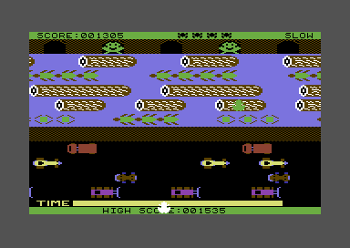

# *sevenon's project archive*
 
 
 

# memorabilia

Apple IIe - I wrote my first program on it. It was in year ten at a Melbourne high school. I was immediately hooked.
 
 
 

  

Shortly after my parents bought me a Commodore 128. I had an amber monochrome monitor, disk drive and a dot matrix printer too.
 
 
 

 

My first IT puchase was a book titled: Commodore 64 Programmer's Reference Guide. It's one of the few memoribila I kept from my teens. A family friend gave me another book titled: A Commodore 64 mikrogep kezelese es programozasa. It was from Hungary.
 
 
 

I played Frogger a lot, unfortunately it was terribly slow to load from a casette tape. I figured out a way to save the entire game to a floppy disk. I was staring at assembly code for days.
 
 
 

# toyrouter - a linux router stripped to bare essentials 
*September 2020*

It is a Linux WAN to LAN router, bare bones, super simple, only uses busybox and iptables in user space. Built as a programming exercise, but functional. Probably the simplest router you will find.
 
 
 

# bminus - a c subset compiler
*November 2014*

Finally got around writing a compiler, always wanted to write a compiler that at least can compile itself.

Generates assembler or javascript. It can compile itself from within a web browser.

The challenge was to find a valid subset of c that can be compiled straight from a recursive parser. 

The code closely follows the BNF grammar. Most straight forward design, at least for what it is.

- [Hello world](bminus/hello-world)
- [Language syntax](bminus/language-syntax)
- [Online compiler](bminus/online-compiler)
- [Source code](bminus/source-code)
- [Building the source](bminus/building-the-source)

 
 

*September 2020*

Compiles under Ubuntu 20.04. Replaced Oracle jjs with NodeJs.

 
 
 

-----
sevenon.au@gmail.com

