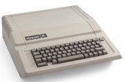
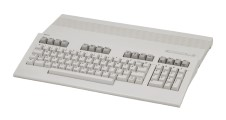
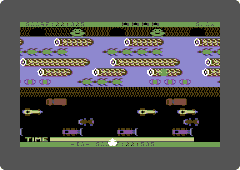

# *sevenon's project archive*
[https://github.com/sevenon](https://github.com/sevenon)

 
 

# memorabilia

Apple IIe - I wrote my first program on an Apple IIe. It was year ten at a Melbourne high school. I was immediately hooked.

 

 &nbsp;&nbsp;&nbsp;&nbsp;&nbsp;&nbsp;&nbsp;  &nbsp;&nbsp;&nbsp;&nbsp;&nbsp; 

Shortly after my parents bought me a Commodore 128. I had an amber monochrome monitor, disk drive and a dot matrix printer too.

My first IT purchase was a book titled: Commodore 64 Programmer's Reference Guide. It's one of the few memorabilia I kept from my teens. A family friend gave me another book titled: A Commodore 64 mikrogep kezelese es programozasa. It came from Hungary.

 

I played Frogger a lot, unfortunately it was terribly slow to load from a casette tape. I figured out a way to save the entire game to a floppy disk. I was staring at assembly code for days.

 
 

# toyrouter - a linux router stripped to bare essentials 
[https://github.com/sevenon/toyrouter](https://github.com/sevenon/toyrouter)

 

*September 2020*

Bare bones Linux WAN to LAN router.

Only uses busybox and iptables in user space. Built as a programming exercise, but functional. Probably the simplest router you will find.

Installs over Ubuntu by creating a new entry in the boot menu. Uses overlayfs without modifying the Ubuntu user space. 

Combines the simplicity of a busybox user space with the ease of installation of Ubuntu.

I got the inspiration from [The Ars guide to building a Linux router from scratch](https://arstechnica.com/gadgets/2016/04/the-ars-guide-to-building-a-linux-router-from-scratch/).
I decided that I wanted something that is even more from "scratch".

- [Testing in VMWare](toyrouter/testing-in-vmware)
- [Source code and configuration](toyrouter/source-code)

 
 

# bminus - a c subset compiler
[https://github.com/sevenon/bminus](https://github.com/sevenon/bminus)

 

*November 2014*

Minimalist C subset compiler. Capable of compiling itself, no external dependencies, no linking, does not use the C library.

Retargetable with four different back ends:
- C virtual CPU
- Javascript virtual CPU
- Assembler
- Linux elf executable

Straight forward design. BNF rules map to one function in general. Code is generated straight from a recursive parser.

- [Hello world](bminus/hello-world)
- [Language syntax](bminus/language-syntax)
- [Online compiler](bminus/online-compiler)
- [Source code](bminus/source-code)
- [Building the source](bminus/building-the-source)

 

*September 2020*

Compiles under Ubuntu 20.04. Replaced Oracle jjs with NodeJs.

 

*October 2020*

New target for generating Linux elf binary.

 

-----
sevenon.au@gmail.com

